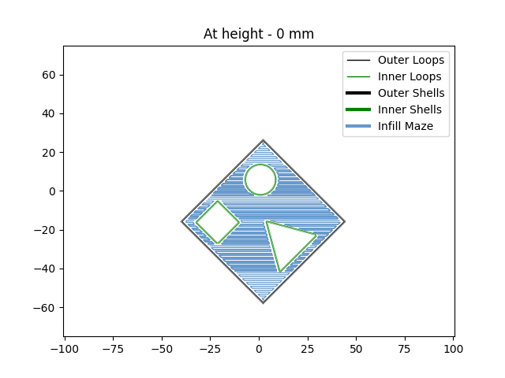
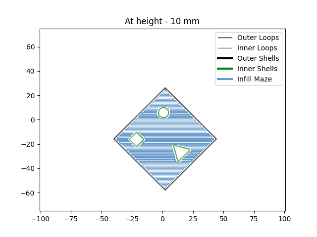

# Assignment 2

The assignment for FabHeads Automation.

## Installation

Use the package manager [pip](https://pip.pypa.io/en/stable/) to install the depedancies.

```bash
pip install -r requirements.txt
```
## Running the code

```bash
python main.py
```

## Results





## Known Bugs (can be dealt with if given time)
 1. Places where the boundaries are too close (less than the raster width) is taken to be continuous

2. Animation does not work in synchronization

3. Resolution of places where the shells are coinciding is not dealt with. 

4. 3D view of the raster cross section not yet implemented